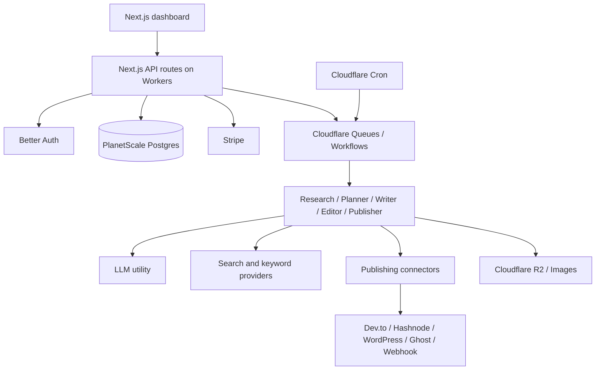

# SEO_AI Product and Architecture Plan

> Status: v1 planning baseline. This document captures the product decisions and
> technical direction for the first working SaaS version.

## 1. Product vision

SEO_AI is an autonomous content marketing SaaS for companies that want regular,
high-quality organic content without running a manual editorial process.

The product should:

1. Learn the user's brand, audience, product, competitors, and target keywords.
2. Research the market and discover useful topics.
3. Generate SEO-ready articles up to the customer's weekly plan limit.
4. Let users connect publishing platforms and publish to all enabled platforms.
5. Offer human review when selected, while defaulting to full automation.
6. Keep every article editable, exportable as Markdown, and traceable in an
   activity log.

## 2. v1 scope

The first version should be fully usable, but deliberately small.

### Included

- Better Auth login with Google and GitHub.
- One SaaS workspace per account for v1.
- Subscription plans and plan-based weekly article caps.
- Brand profile, competitors, seed keywords, tone, and target audience setup.
- Connected publishing destinations.
- Topic discovery from web search, competitor RSS/sitemaps, emerging search
  trends, question-style queries, and optional paid keyword APIs.
- Topic backlog with score, rationale, status, and source.
- Article generation, SEO editing, Markdown export, and optional image prompt or
  image generation.
- Autonomy controls: `REVIEW` or `FULL_AUTO`, defaulting to `FULL_AUTO`.
- Scheduled research and writing.
- Publishing records, retryable failures, and activity logs.

### Deferred

- Multi-workspace/team permissions beyond the minimum owner account.
- Advanced analytics from Google Search Console or Google Analytics.
- Complex custom approval workflows.
- Usage-based billing. v1 uses fixed subscription caps.
- Large connector marketplace. Start with the highest-value connectors.

## 3. Tech stack

| Concern | Choice | Notes |
| --- | --- | --- |
| App + API | Next.js + TypeScript | App Router for UI and API routes |
| Runtime | Cloudflare Workers | Deploy the web/API app on Cloudflare |
| Scheduled work | Cloudflare Cron Triggers | Weekly research and article scheduling |
| Async work | Cloudflare Queues or Workflows | Use when jobs need retries/durability |
| Database | PlanetScale Postgres | Main relational store |
| ORM | Drizzle ORM | Typed schema and migrations with low overhead |
| Auth | Better Auth | Google and GitHub providers only in v1 |
| Billing | Stripe Billing + Checkout | Subscriptions, Customer Portal, webhook sync |
| Storage | Cloudflare R2/Images | Markdown artifacts and generated images |
| LLM | OpenAI-compatible SDK utility | Configurable base URL, API key, and model ids |
| UI | Tailwind CSS + minimal component primitives | Keep the interface reusable and simple |

Cloudflare implementation should use bindings for platform services, secrets for
credentials, Hyperdrive for Postgres connections when applicable, structured
logs, and no request-scoped mutable global state.

## 4. Pricing and plan limits

Weekly article caps are "up to" limits. The agent should not publish filler
content when topic quality is low.

| Plan | Price | Cap |
| --- | ---: | ---: |
| Indie | $29/month | Up to 4 articles/week |
| Startup | $69/month | Up to 10 articles/week |
| Scale | $199/month | Up to 50 articles/week |
| Enterprise | $499/month | Up to 300 articles/week |

Stripe should use subscription Checkout Sessions, Stripe Prices, the Customer
Portal for self-service changes, and signed webhook verification. Do not hardcode
payment method types; rely on Stripe dynamic payment methods.

## 5. Core architecture

## 6. Main modules

- `auth`: Better Auth setup, OAuth callbacks, user/session helpers.
- `billing`: Stripe Checkout, Customer Portal, plan sync, webhook handling.
- `db`: Drizzle schema, migrations, repositories, and typed query helpers.
- `llm`: reusable OpenAI-compatible client, model selection, JSON helpers, cost
  metadata, and prompt wrappers.
- `research`: provider adapters for web search, keyword APIs, RSS, sitemap, and
  lightweight page extraction.
- `agents`: research, topic planner, writer, editor, image assistant, publisher.
- `publishing`: destination adapters with a shared publish contract.
- `jobs`: cron handlers, queue/workflow handlers, retries, and job locking.
- `ui`: dashboard routes, forms, tables, article editor, and settings screens.

## 7. LLM utility design

Use a single reusable utility so agents do not know provider details.

Environment-driven config:

- `LLM_BASE_URL`
- `LLM_API_KEY`
- `LLM_LIGHT_MODEL`
- `LLM_HEAVY_MODEL`
- `LLM_IMAGE_MODEL`

Task routing:

| Task type | Model tier |
| --- | --- |
| Classification, summaries, title variants, status explanations | Light |
| Topic strategy, article outlines, full drafts, SEO edits | Heavy |
| Image prompts or generated blog images | Image model |

The utility should expose explicit methods such as `generateText`,
`generateJson`, and `generateImage` so downstream code stays small and testable.

## 8. Publishing strategy

v1 should let users connect all supported platforms and enable/disable each one.
The publishing agent publishes an approved article to every enabled destination.

Initial v1 connector set:

1. Markdown export to R2/download.
2. Dev.to.
3. Hashnode.
4. WordPress.
5. Ghost.
6. Medium where account/API access allows it.
7. LinkedIn where account/API access allows it.
8. Generic webhook.

All enabled destinations should use the same publish contract so adding or
removing a platform does not change the article workflow.

## 9. Research strategy

The product should choose research providers based on content quality, not vendor
preference.

Start with:

- Web search provider adapter.
- Competitor RSS and sitemap discovery.
- Trend and question discovery for queries people are newly asking, including
  Google-style autocomplete, People Also Ask, rising searches, forum questions,
  and SERP question patterns through approved provider APIs.
- Basic page extraction for titles, headings, summaries, and canonical URLs.
- Optional paid keyword provider adapter when credentials are present.

Topic scoring should consider relevance, search intent, competitor gap,
freshness, expected difficulty, plan capacity, and product-as-answer fit. Topics
from emerging queries should get a freshness boost only when the product can
credibly answer the user's underlying problem.

## 10. Data model sketch

Use Drizzle tables with these core entities:

- `users`: Better Auth user records.
- `workspaces`: one v1 workspace per owner account.
- `subscriptions`: Stripe customer, subscription, price, plan, status, and caps.
- `brand_profiles`: product description, audience, tone, seed keywords.
- `competitors`: competitor names, URLs, RSS/sitemap metadata.
- `integrations`: publishing destination config and secret references.
- `research_runs`: input, findings, summary, status, and cost metadata.
- `trend_queries`: emerging questions, source, intent, freshness, answer fit, and
  evidence URLs.
- `topics`: title, angle, keywords, score, rationale, source, and status.
- `articles`: topic, title, slug, Markdown, SEO metadata, status, and version.
- `publications`: platform, external id, URL, status, errors, and timestamps.
- `agent_runs`: agent kind, input/output refs, status, token usage, and cost.
- `usage_counters`: weekly article generation/publish counts per workspace.

Keep the schema normalized enough for product behavior, but avoid building a
generic workflow engine in v1.

## 11. Autonomy rules

| Mode | Behavior |
| --- | --- |
| `FULL_AUTO` | Research, write, edit, and publish to enabled platforms automatically. |
| `REVIEW` | Research and draft automatically, then wait for human approval before publishing. |

Default is `FULL_AUTO`. Users can switch the workspace default and override an
individual article before publishing.

Hard stops apply in both modes:

- Do not exceed the active plan's weekly cap.
- Do not publish when topic quality is below threshold.
- Do not publish if required integrations are disconnected or failing auth.
- Do not retry indefinitely after platform errors.

## 12. v1 success criteria

A successful v1 lets a paid user:

1. Sign in with Google or GitHub.
2. Subscribe through Stripe.
3. Configure their brand and competitors.
4. Connect at least one publishing platform.
5. Generate a topic backlog.
6. Produce a Markdown article from a topic.
7. Publish it automatically in `FULL_AUTO` or approve it in `REVIEW`.
8. See status, errors, and publication URLs in the dashboard.

## 13. Implementation phases

See [`docs/v1-implementation-phases.md`](v1-implementation-phases.md) for the
phase-by-phase build plan and acceptance criteria.
